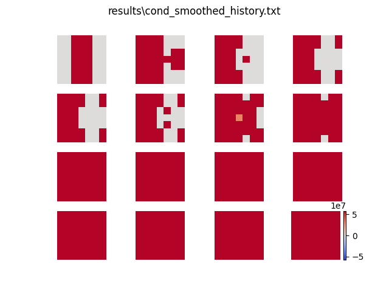
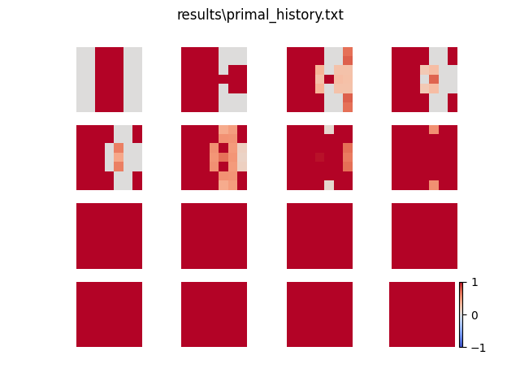
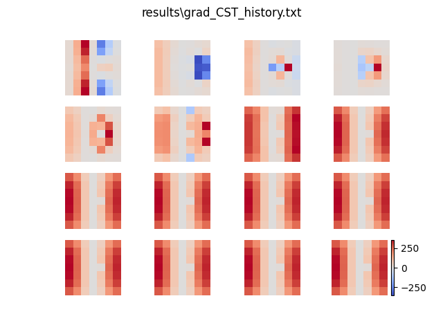
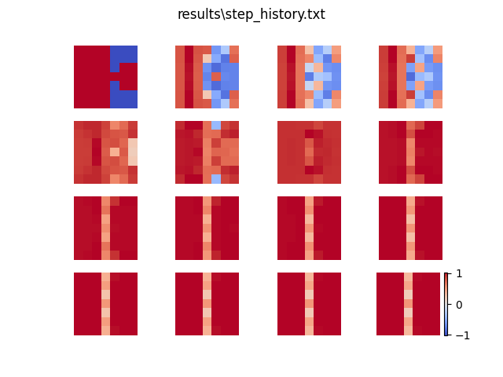
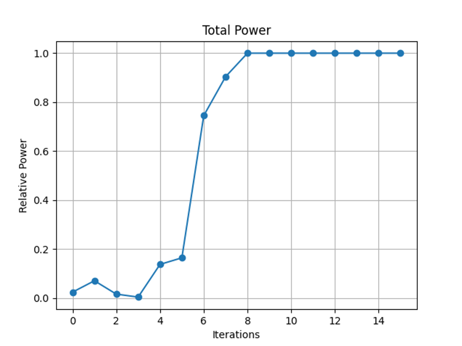

# Antenna Topology Optimization by Adjoint Method
## Introduction
This is a python implementation for antenna design automation. The program will automatically generate a planar antenna on a given design region according to input specifications such as operating frequency and bandwidth. This is done by solving an optimization problem which is to maximize the power recieved from the coaxial cable feed for an antenna in Rx mode. Unlike traditional evolutionary optimization methods, adjoint method is adopted to calculate gradient and subsequently conduct gradient descent. In adjoint method theory, we consider each antenna topology as a functional, we can obtain the variation of the functional by performing inner product on the electric fields calculated from solving a forward problem and an adjoint problem. CST Studio Suite® 2023 is used to solve the forward and adjoint problem to obtain electric fields and power. Python is used to control the antenna design automation process such as setting up and calling CST, calculate gradient, and iteratively conduct gradient descent, etc.

**Reference:** Topology Optimization of Metallic Antennas.” _IEEE Transactions on Antennas and Propagation_ 62, no. 5 (May 2014): 2488–2500. [https://doi.org/10.1109/TAP.2014.2309112](https://doi.org/10.1109/TAP.2014.2309112).

---
## Setup
Before running the code, ensure you have the following installed:
- **CST Studio Suite®**: To solve EM problems. Official interface only support python 3.6~3.9.
- **Git**: To clone this repository.
- **Miniconda** or **Anaconda**: To manage the Python environment and dependencies.

### 1. Install Git
- **Windows**: Download and install Git from [git-scm.com](https://git-scm.com/downloads). Follow the default installation options.

Verify Git is installed by running:
```
git --version
```

### 2. Install Miniconda
Miniconda is a lightweight version of Anaconda that manages Python environments.
- Download Miniconda from [docs.conda.io](https://docs.conda.io/en/latest/miniconda.html) (choose the version for your OS: Windows, Mac, or Linux).
- Follow the installer instructions:
  - **Windows**: Double-click the `.exe` file and follow the prompts. Check "Add Miniconda to my PATH" if available.
- Restart your terminal after installation.

Verify Miniconda is installed by running:
```
conda --version
```

### 3. Clone the Repository
In a terminal or command prompt, navigate to the folder where you want the project and run:
```
git clone https://github.com/electronics10/Topology_Optimization.git
```
Then, enter the project directory:
```
cd Topology_Optimization
```

### 4. Set Up the Conda Environment
This project uses a predefined environment file (`environment.yml`) to install all dependencies.

- Create the environment (for Windows only):
```
conda env create -f environment.yml
```
- Activate the environment:
```
conda activate autotune
```

### 5. Run the Code
- Run the main script:
```
python main.py
```


### Troubleshooting
- If `conda` commands don’t work, ensure Miniconda is added to your system PATH or restart your terminal.
- For errors during `conda env create`, ensure you have an active internet connection, as it downloads packages.
- For errors about CST, ensure CST is added to your system PATH. It can also be done by altering the first few line in `Antenna_Design.py`, such as `sys.path.append(r"C:\Program Files (x86)\CST STUDIO SUITE 2023\AMD64\python_cst_libraries")`.
- Other CST errors might occur due to version difference and cause filepath name variation. One may check the correct file name in CST and change it in `Antenna_Design.py` according to prompt.
- Contact me for any further issues.

---

## Guide: Optimizing an Antenna Design

This section provides an example of how to use this repository to optimize an antenna design. Follow the steps below to replicate the results.

### 1. Understand the Design Domain
The design region is defined in `Antenna_Design.py`. By default, the design domain is a 48mm x 48mm square, pixelized with 3mm x 3mm sized pixel. Modifying this file is not recommended unless you are confident in what you are doing, as it may affect the optimization process.

### 2. Configure Input Specifications
The input specifications for the antenna can be manually altered in `main.py`. Open `main.py` and look for the following lines after the `import` statements:
```python
AMP = [1]  # weight for different frequency signal
FREQ = [2.45]  # GHz
BW = [0.07]  # ratio bandwidth
```
- `AMP`: The weight for different frequency signals.
- `FREQ`: The operating frequency in GHz (e.g., 2.45 GHz in this example).
- `BW`: The ratio bandwidth.

Here, the antenna is optimized to operate at 2.45 GHz with a bandwidth ratio of 0.07. You can add more frequencies, amplitudes, and bandwidths to the lists if needed (e.g., `AMP = [0.5, 0.5]`, `FREQ = [1.8, 2.45]`, `BW = [0.1, 0.07]` for dual-band optimization).

**Note**: Polarization support is still under development and may be added in future updates.

### 3. Run the Optimization
To optimize the antenna according to the specified parameters, run the main script:
```
python main.py
```

#### Antenna Design Domain Creation
When `main.py` is executed for the first time, the script will create the antenna design domain, including components such as the substrate, ground, and feed. This is controlled by the following line in `main.py`:
```python
optimizer = ad.Optimizer(topop, topop, set_environment=True)
```
The `set_environment` parameter determines whether the design domain is initialized:
- **First Run**: Keep `set_environment=True` to create the domain.
- **Subsequent Runs**: Set `set_environment=False` to avoid recreating the domain, as it already exists. Failing to do so may result in a minor bug where the script attempts to overwrite the existing domain, potentially causing inconsistencies.

To modify this setting, open `main.py`, locate the `optimizer` initialization line, and adjust the `set_environment` parameter as needed before running the script.

### 4. Visualize the Iteration Process
After running `main.py`, you can visualize the antenna's growth over iterations by running:
```
python plotter.py
```
This script will show four images, each representing a different aspect of the optimization process. Here is an example of antenna operating at 1.7 GHz:

- **Conductivity Distribution**: The real conductivity distribution of the antenna topology. This shows the physical layout of the antenna.
  

- **Normalized Conductivity**: The conductivity values mapped to the interval [0, 1] and displayed in a log scale for clearer visualization of variations.
  

- **Gradient**: The gradient calculated using the adjoint method, showing the sensitivity of the design to changes.
  

- **Step**: The actual step used for gradient descent. By default, the Adam optimization method is enabled, which may make this different from the gradient image. You can disable Adam in `main.py` if desired.
  

Each image shows the antenna's evolution over iterations, with a color bar indicating the scale of values (e.g., conductivity, gradient magnitude).

### 5. Analyze Total Power
To evaluate the performance of the optimization, run:
```
python total_power.py
```
This will show a plot of the relative power received at each iteration. If the optimization is working correctly, you should see the power tend to increase as iterations progress, as shown below:


The plot shows the relative power (y-axis) increasing over iterations (x-axis), indicating that the antenna design is improving.

### 6. Verify the Design with CST
To rerun the iterations and verify the antenna's performance using CST, run:
```
python verification.py
```
This script regenerates the antenna topology from previous iterations for validation. It’s a straightforward antenna drawing code with no additional modifications. One need to input iteration index and threshold in the terminal. Threshold is adviced to set us `0.95`. The antenna topology will be demonstrated before setting up CST. Enter `y` to continue the verification process in CST.

---
